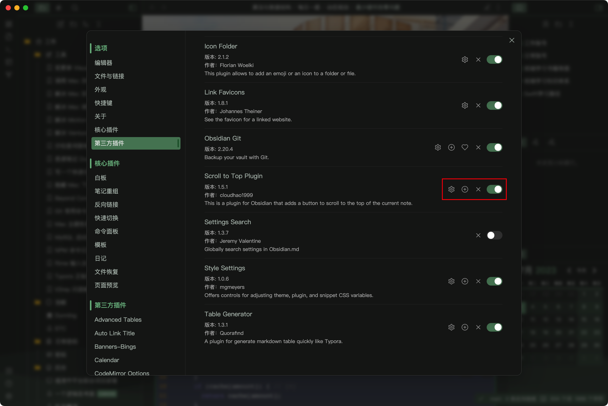
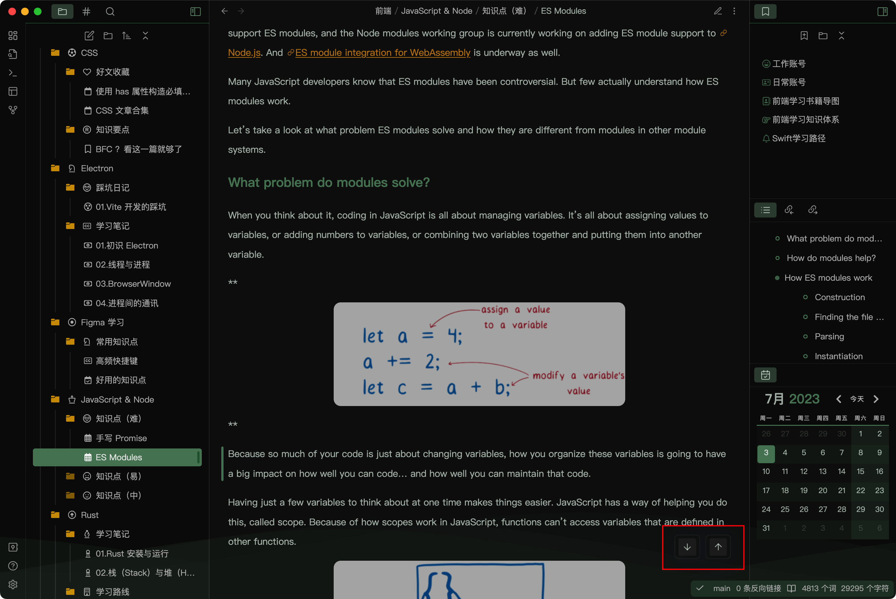
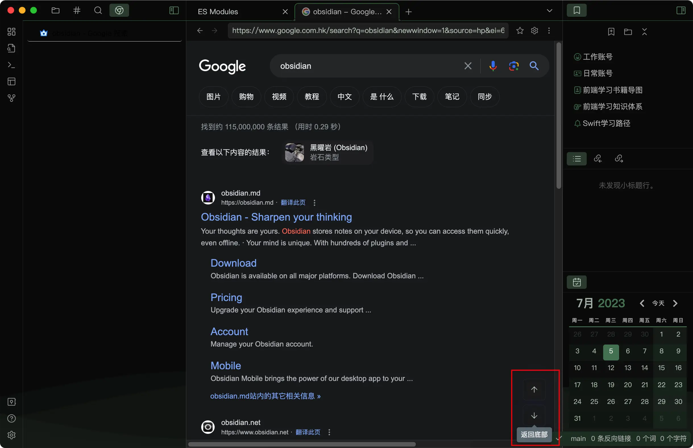
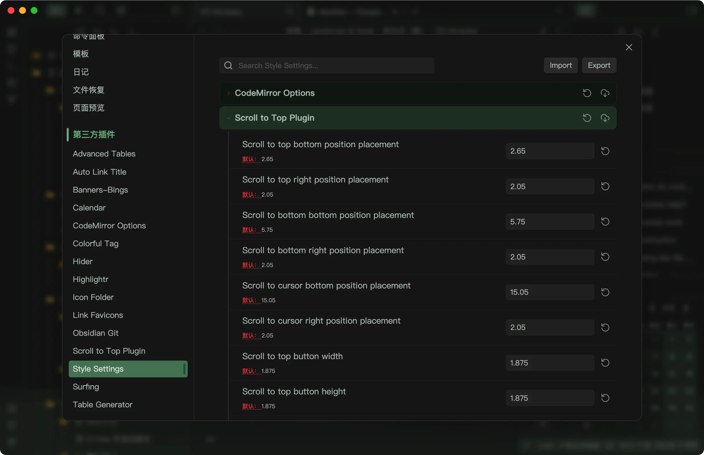
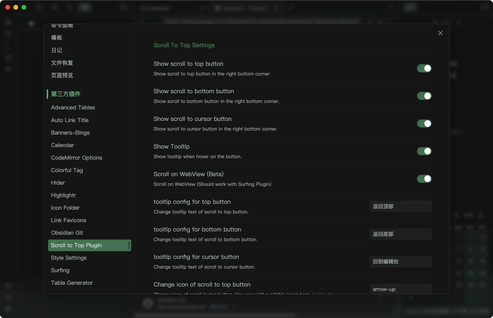

# Scroll To Top

This is a plugin for Obsidian that adds a button to scroll to the top of the current note (Not just that).

## How to use

-  Install the plugin

- Click the button in the status bar to scroll to the top or bottom of the note

- Click the button in the ribbon to scroll until the selection or cursor (in the edit mode)

- You can use this plugin in a Obsidian browser (should work with the Surfing plugin)

- Customize the button style (should work with Style Settings Plugin)

- Edit more button options in the plugin settings

